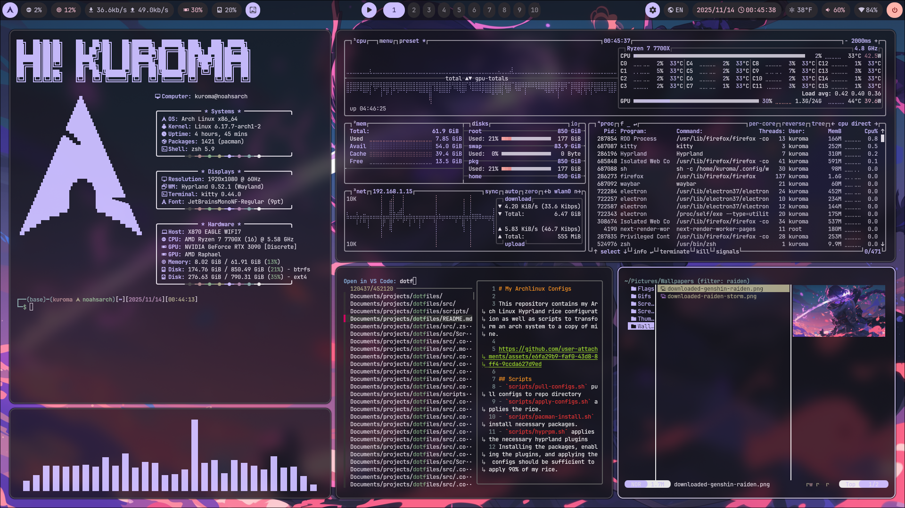
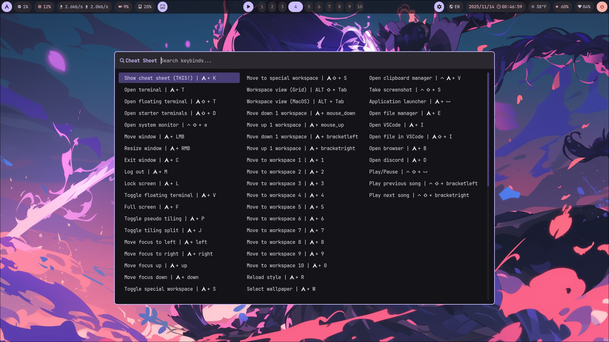
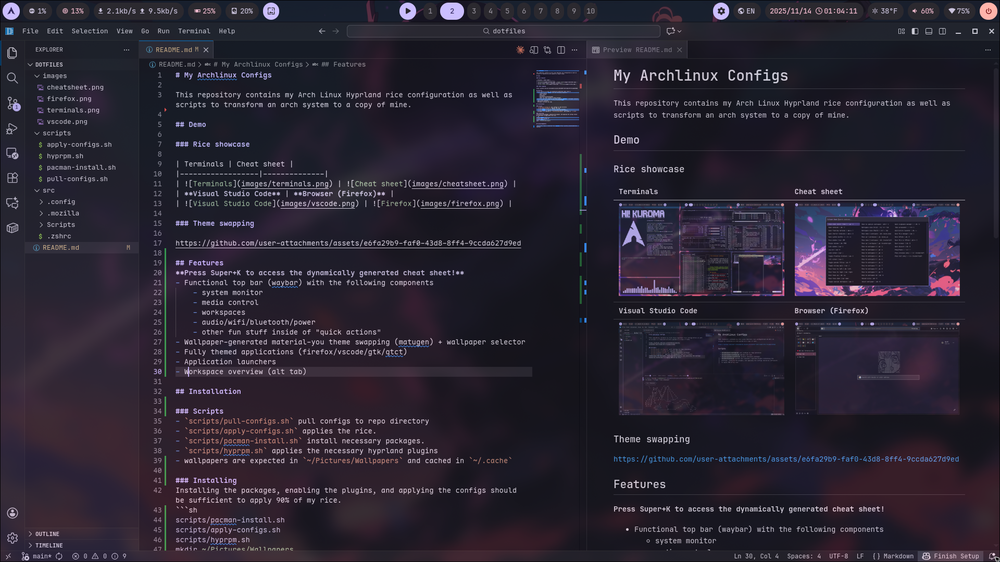
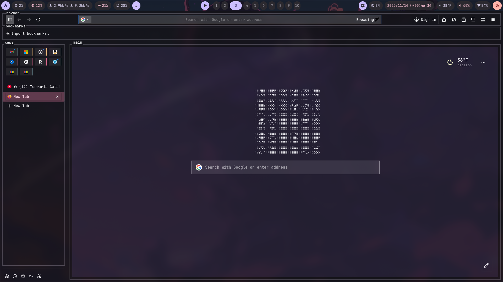
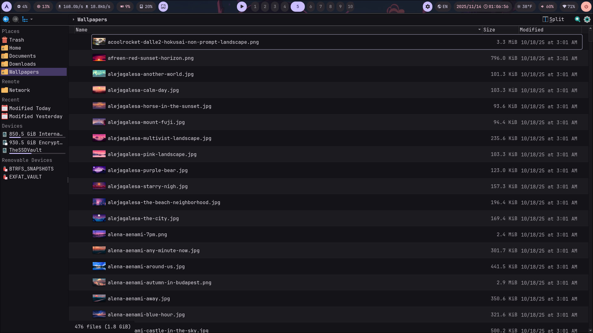
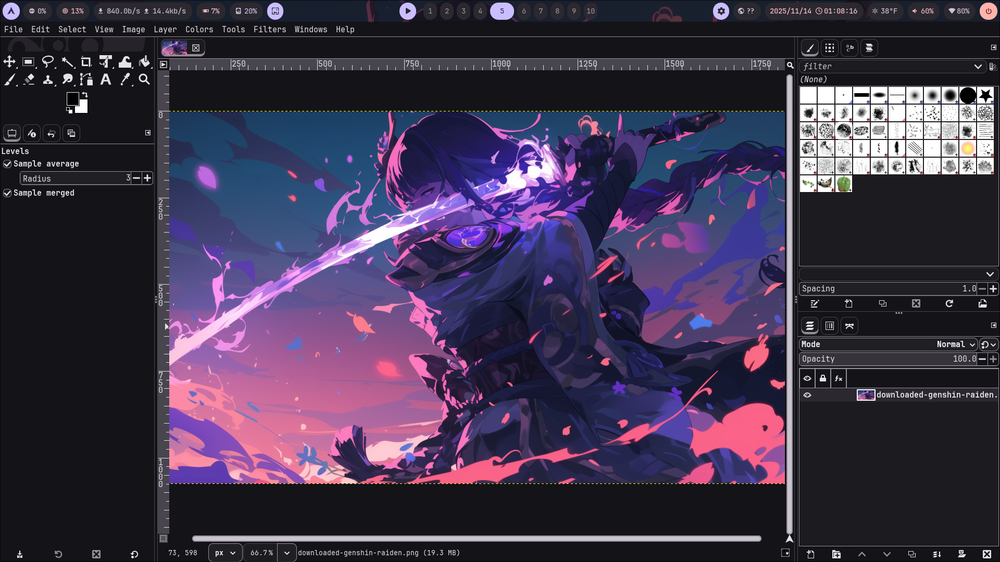

# My Hyprland Desktop Configs

This repository contains my Arch Linux Hyprland rice configuration as well as scripts to transform an arch system to a copy of mine.

## Demo

### Rice showcase

| Terminals | Cheat sheet |
|------------------|--------------|
|  |  |
| **Visual Studio Code** | **Browser (Firefox)** |
|  |  |
| **Dolphin (QT)** | **GIMP (GTK)** |
|  |  |

### Theme swapping + Animated wallpaper

https://github.com/user-attachments/assets/6e62c5ae-b80c-4d13-82e5-a0f5d0adbfe2

## Features
**Press Super+K to access the dynamically generated cheat sheet!**
- **Waybar**: top bar with the following components
    - system monitor
    - media control
    - workspaces
    - audio/wifi/bluetooth/power
    - other fun stuff inside of "quick actions"
- **Matugen**: controls the global theme based on the selected wallpaper
- **GSlapper**: a memory-efficient implementation of mpvpaper for animated wallpapers
- **Teriminal apps**: like yazi and neovim are themed based on the Ansi colors
- **GTK/QT**: applications are fully themed
- **Other apps**: like firefox and vscodium are themed as well
- **Workspace layout**: each workspace can be set to specific layout on-the-fly. **Hyprscrolling** supports a niri-like scrolling layout
- **Workspace overview**: alt tab-like overview with **hyprexpo**

## Installation

See more at 

## Known issues

- Hyprscrolling crashes when scrolled out-of-bounds [(issue thread)](https://github.com/zakk4223/hyprWorkspaceLayouts/issues/37)
- GTK and QT apps currently requires a restart to hot-reload themes.

## Acknowledgements

- My firefox `userChrome.css` is modified from [textfox](https://github.com/adriankarlen/textfox)
- Rofi bluetooth module is modified from [rofi-bluetooth](https://github.com/nickclyde/rofi-bluetooth)